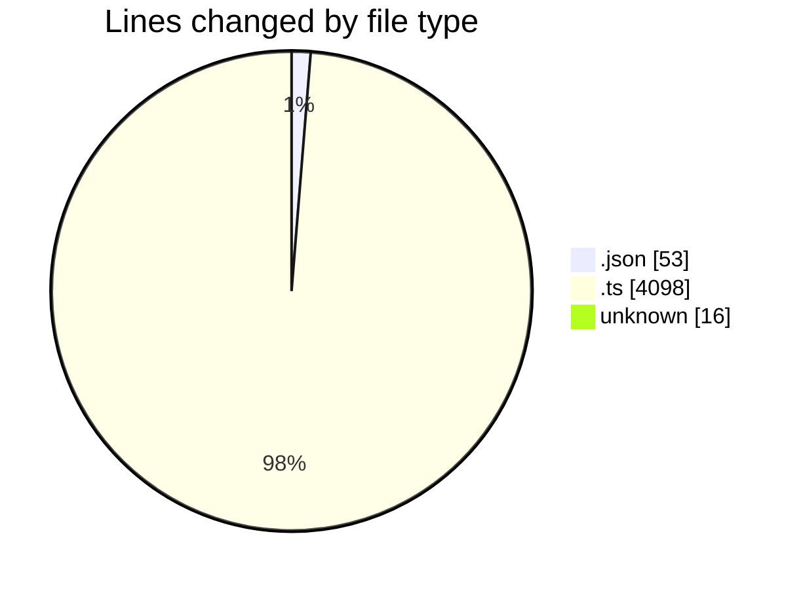
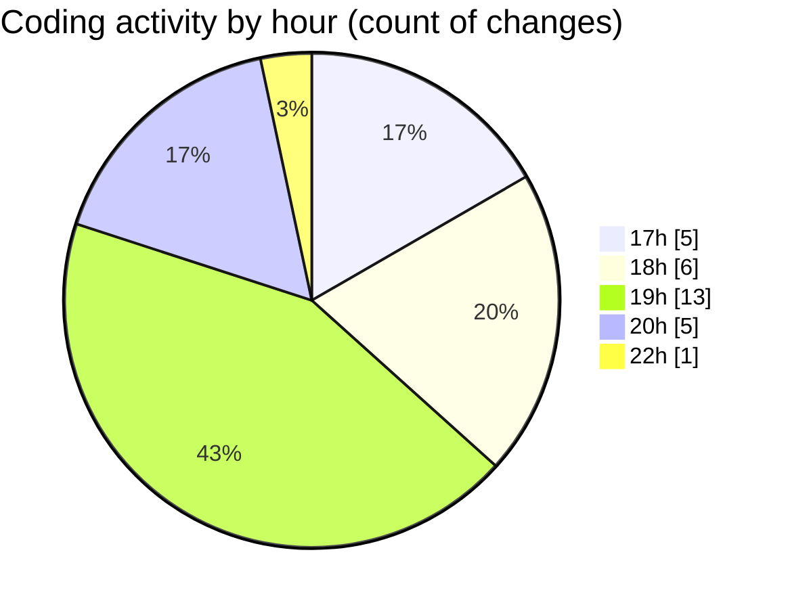

# SingularityBrainAi - Activity Summary 

## Overall Statistics

| Stat                   | Value                                                             |
| ---------------------- | ----------------------------------------------------------------- |
| **Lines Added** (➕)   | 4154                                          |
| **Lines Removed** (➖) | 13                                        |
| **Net Change** (↕)    | 4141                |
| **Active Time** (⌚)   | 28 minutes |

## Modified Files
- **settings.json** (+51, -2)
- **GPUBackend.ts** (+2183, -0)
- **ParityHarness.ts** (+894, -11)
- **COMMIT_EDITMSG** (+16, -0)
- **CPUBackend.ts** (+1010, -0)

## Visualizations

### By File Type (Lines Changed)

### By Hour (Estimated Activity Count)

> **Last Updated:** 2/1/2026, 11:01:21 PM