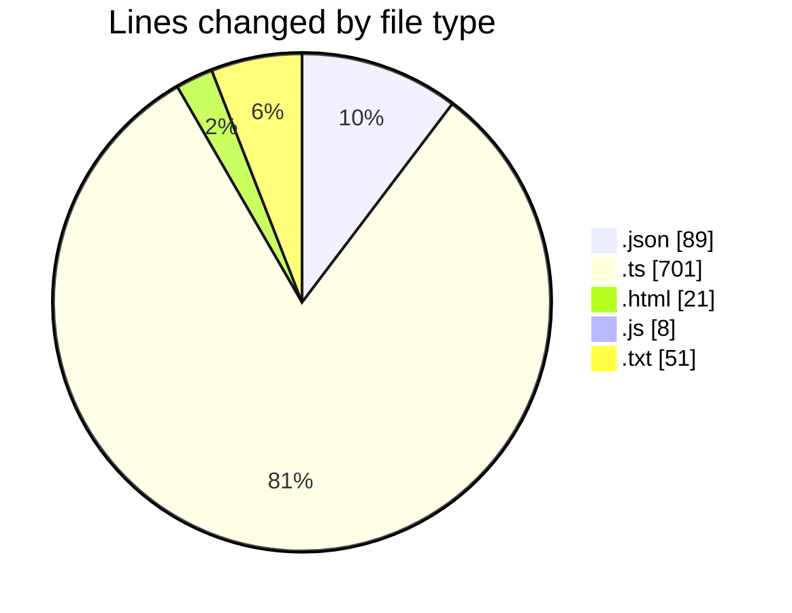
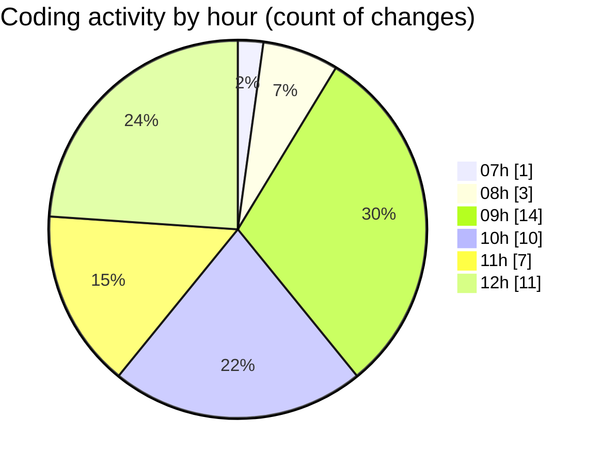

# SingularityBrainAi - Activity Summary 

## Overall Statistics

| Stat                   | Value                                                             |
| ---------------------- | ----------------------------------------------------------------- |
| **Lines Added** (➕)   | 846                                          |
| **Lines Removed** (➖) | 24                                        |
| **Net Change** (↕)    | 822                |
| **Active Time** (⌚)   | 50 minutes |

## Modified Files
- **settings.json** (+86, -3)
- **MinimalRendererWebGL2.ts** (+204, -0)
- **minimalProbe.ts** (+201, -0)
- **probe.html** (+21, -0)
- **vite.config.js** (+8, -0)
- **Camera.ts** (+111, -0)
- **InputController.ts** (+164, -21)
- **new_vs.txt** (+32, -0)
- **new_fs.txt** (+19, -0)

## Visualizations

### By File Type (Lines Changed)

### By Hour (Estimated Activity Count)

> **Last Updated:** 2/2/2026, 12:49:08 PM