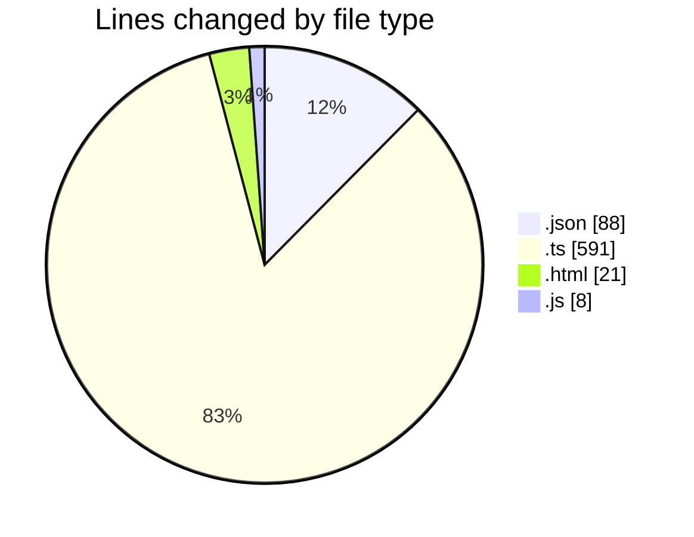
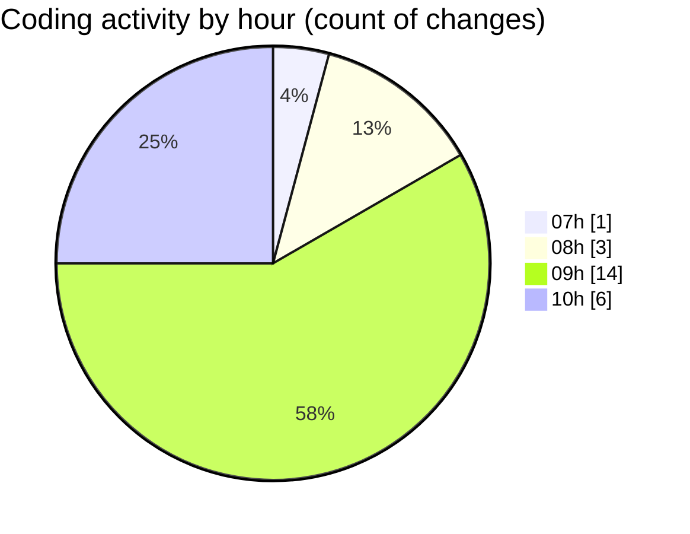

# SingularityBrainAi - Activity Summary 

## Overall Statistics

| Stat                   | Value                                                             |
| ---------------------- | ----------------------------------------------------------------- |
| **Lines Added** (➕)   | 684                                          |
| **Lines Removed** (➖) | 24                                        |
| **Net Change** (↕)    | 660                |
| **Active Time** (⌚)   | 21 minutes |

## Modified Files
- **settings.json** (+85, -3)
- **MinimalRendererWebGL2.ts** (+170, -0)
- **minimalProbe.ts** (+134, -0)
- **probe.html** (+21, -0)
- **vite.config.js** (+8, -0)
- **Camera.ts** (+102, -0)
- **InputController.ts** (+164, -21)

## Visualizations

### By File Type (Lines Changed)

### By Hour (Estimated Activity Count)

> **Last Updated:** 2/2/2026, 10:11:05 AM