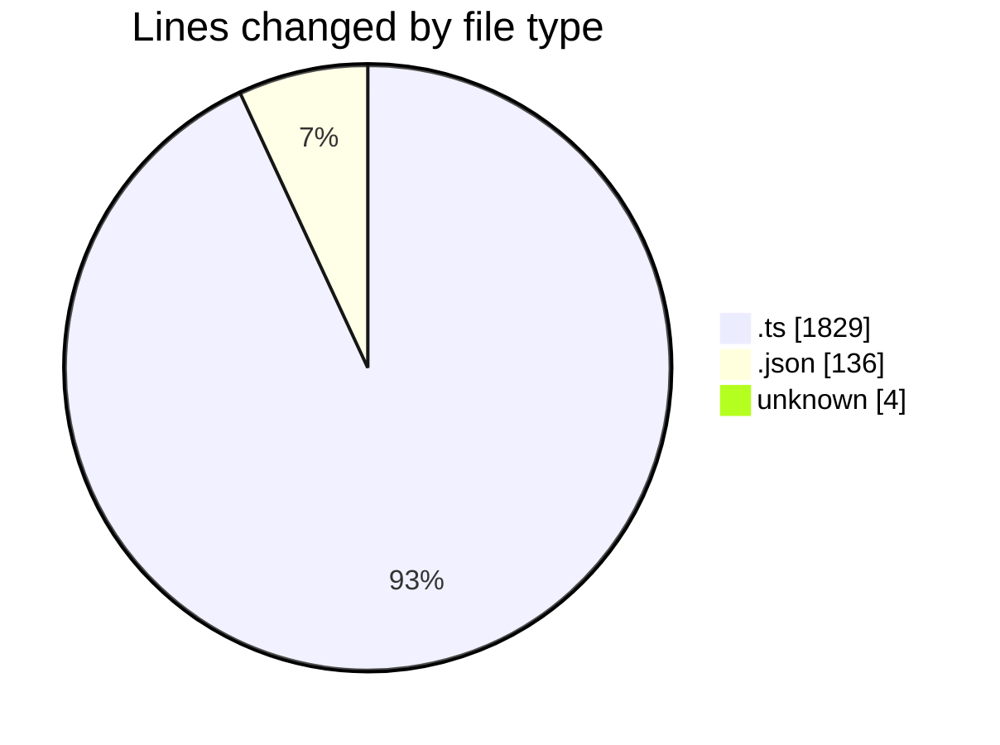
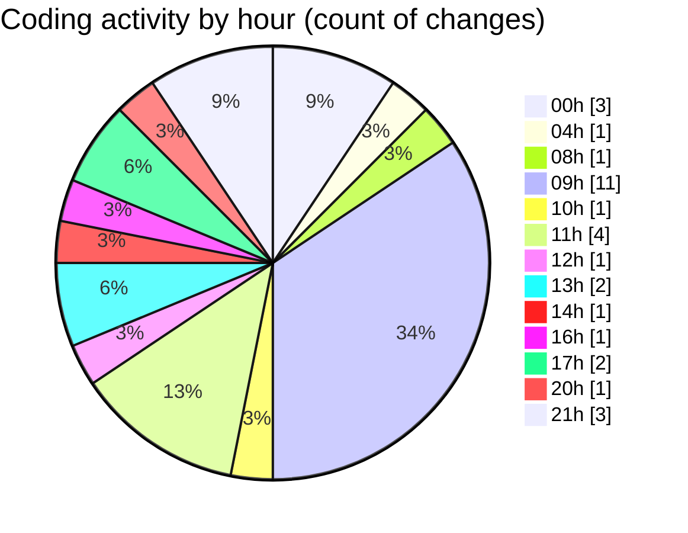

# SingularityBrainAi - Activity Summary 

## Overall Statistics

| Stat                   | Value                                                             |
| ---------------------- | ----------------------------------------------------------------- |
| **Lines Added** (➕)   | 1966                                          |
| **Lines Removed** (➖) | 3                                        |
| **Net Change** (↕)    | 1963                |
| **Active Time** (⌚)   | 26 minutes |

## Modified Files
- **probeMain.ts** (+911, -0)
- **probeGL.ts** (+884, -1)
- **settings.json** (+135, -1)
- **COMMIT_EDITMSG** (+4, -0)
- **TimeScalarDeterminism.spec.ts** (+32, -1)

## Visualizations

### By File Type (Lines Changed)

### By Hour (Estimated Activity Count)

> **Last Updated:** 2/3/2026, 9:38:47 PM