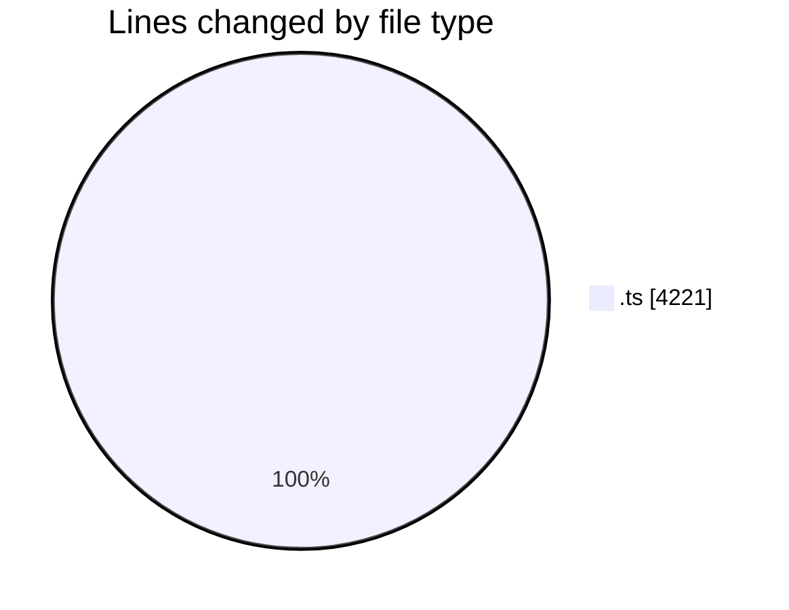
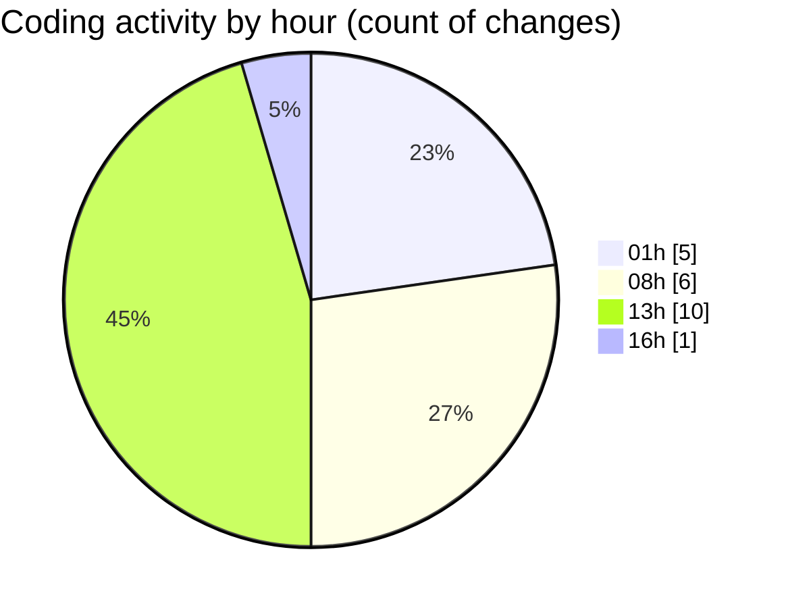

# SingularityBrainAi - Activity Summary 

## Overall Statistics

| Stat                   | Value                                                             |
| ---------------------- | ----------------------------------------------------------------- |
| **Lines Added** (➕)   | 3658                                          |
| **Lines Removed** (➖) | 563                                        |
| **Net Change** (↕)    | 3095                |
| **Active Time** (⌚)   | 20 minutes |

## Modified Files
- **ParityHarness.ts** (+688, -19)
- **ReloadGuard.ts** (+80, -0)
- **GPUBackend.ts** (+1142, -1)
- **probeGL.ts** (+511, -0)
- **probeMain.ts** (+1237, -543)

## Visualizations

### By File Type (Lines Changed)

### By Hour (Estimated Activity Count)

> **Last Updated:** 2/4/2026, 4:23:00 PM