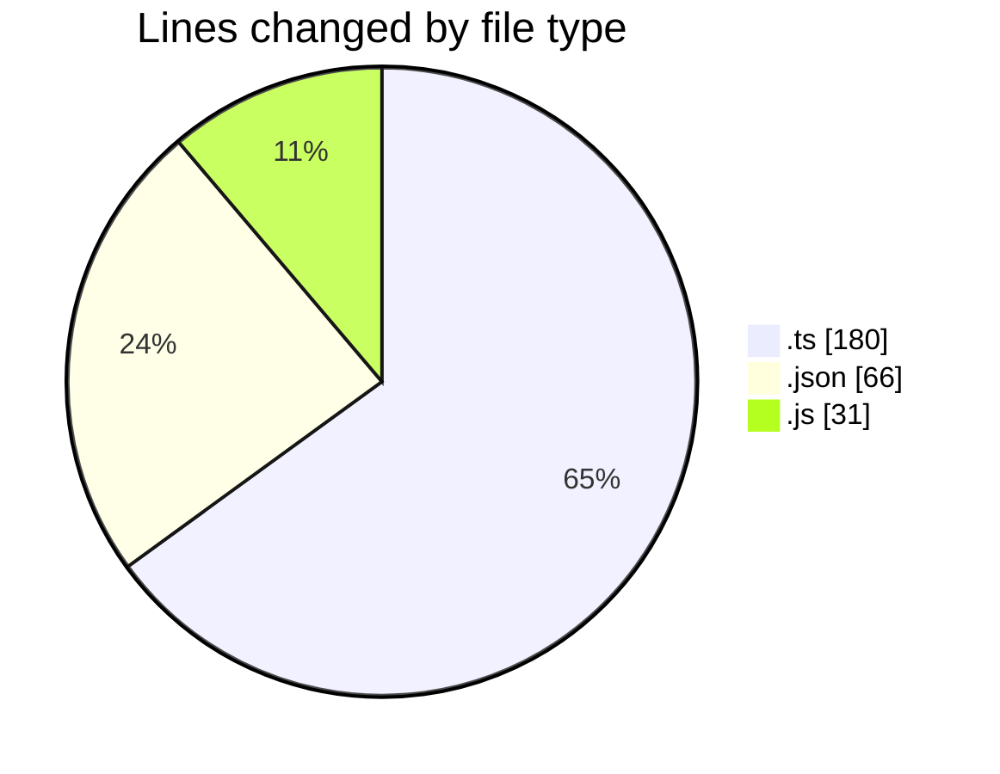
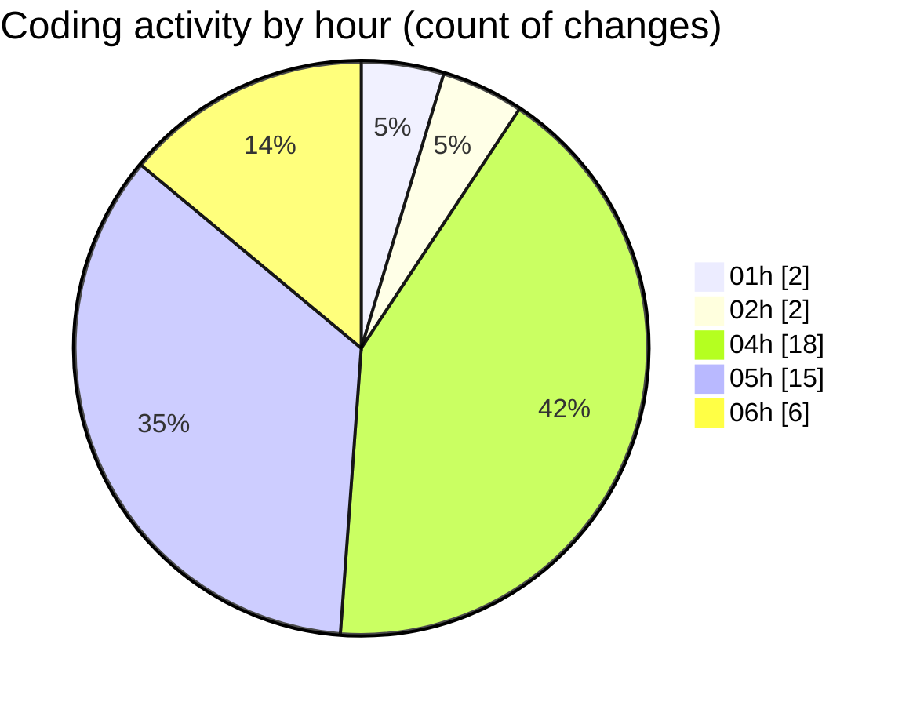

# SingularityBrainAi - Activity Summary 

## Overall Statistics

| Stat                   | Value                                                             |
| ---------------------- | ----------------------------------------------------------------- |
| **Lines Added** (➕)   | 229                                          |
| **Lines Removed** (➖) | 48                                        |
| **Net Change** (↕)    | 181                |
| **Active Time** (⌚)   | 67 minutes |

## Modified Files
- **probeMain.ts** (+120, -48)
- **settings.json** (+66, -0)
- **probeGL.ts** (+12, -0)
- **polish-gate-default-off.spec.js** (+31, -0)

## Visualizations

### By File Type (Lines Changed)

### By Hour (Estimated Activity Count)

> **Last Updated:** 2/5/2026, 6:15:49 AM