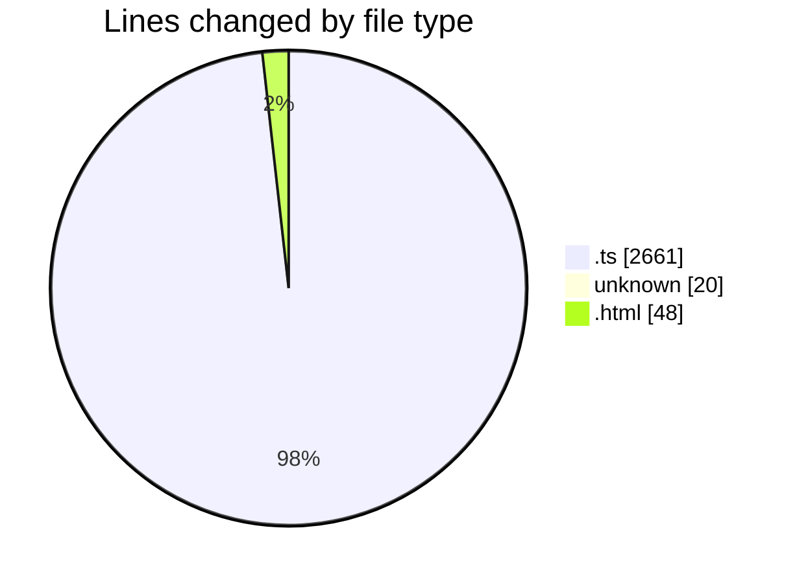
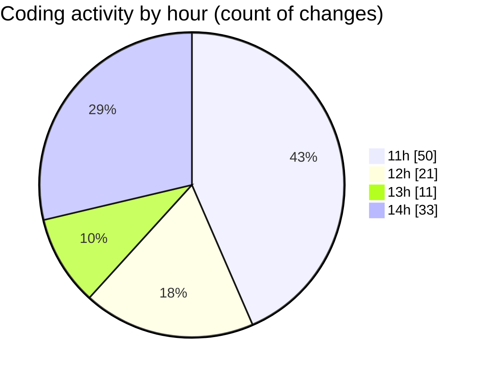

# SingularityBrainAi - Activity Summary 

## Overall Statistics

| Stat                   | Value                                                             |
| ---------------------- | ----------------------------------------------------------------- |
| **Lines Added** (➕)   | 2472                                          |
| **Lines Removed** (➖) | 257                                        |
| **Net Change** (↕)    | 2215                |
| **Active Time** (⌚)   | 118 minutes |

## Modified Files
- **SnapshotRoundTripParity.spec.ts** (+209, -0)
- **LiveResumeParity.spec.ts** (+269, -0)
- **runAll.ts** (+117, -7)
- **.gitignore** (+15, -1)
- **ParityResurrection.spec.ts** (+193, -0)
- **parity_resurrection.html** (+48, -0)
- **GPUBackend.ts** (+1343, -249)
- **COMMIT_EDITMSG** (+4, -0)
- **TextureParityBackend.ts** (+274, -0)

## Visualizations

### By File Type (Lines Changed)

### By Hour (Estimated Activity Count)

> **Last Updated:** 2/6/2026, 2:30:23 PM