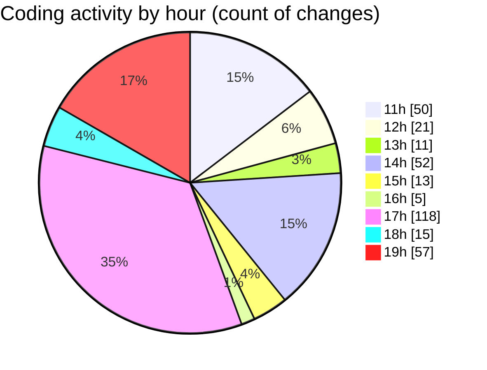

# SingularityBrainAi - Activity Summary 

## Overall Statistics

| Stat                   | Value                                                             |
| ---------------------- | ----------------------------------------------------------------- |
| **Lines Added** (➕)   | 7492                                          |
| **Lines Removed** (➖) | 569                                        |
| **Net Change** (↕)    | 6923                |
| **Active Time** (⌚)   | 383 minutes |

## Modified Files
- **SnapshotRoundTripParity.spec.ts** (+209, -0)
- **LiveResumeParity.spec.ts** (+269, -0)
- **runAll.ts** (+117, -7)
- **.gitignore** (+15, -1)
- **ParityResurrection.spec.ts** (+193, -0)
- **parity_resurrection.html** (+48, -0)
- **GPUBackend.ts** (+1343, -249)
- **COMMIT_EDITMSG** (+4, -0)
- **TextureParityBackend.ts** (+3167, -242)
- **settings.json** (+148, -12)
- **GPUBackendHarness.ts** (+265, -0)
- **CPUBackend.ts** (+960, -10)
- **run_pin_bond_parity.ts** (+186, -0)
- **package.json** (+25, -0)
- **parity.yml** (+14, -0)
- **forces_sanity_probe.spec.ts** (+53, -0)
- **gpu_diagnostic.spec.ts** (+37, -0)
- **gpu_diagnostic_v2.spec.ts** (+296, -48)
- **gpu_diagnostic_final.spec.ts** (+26, -0)
- **parity.html** (+63, -0)
- **diagnostic.html** (+54, -0)

## Visualizations

### By File Type (Lines Changed)

### By Hour (Estimated Activity Count)

> **Last Updated:** 2/6/2026, 7:56:29 PM