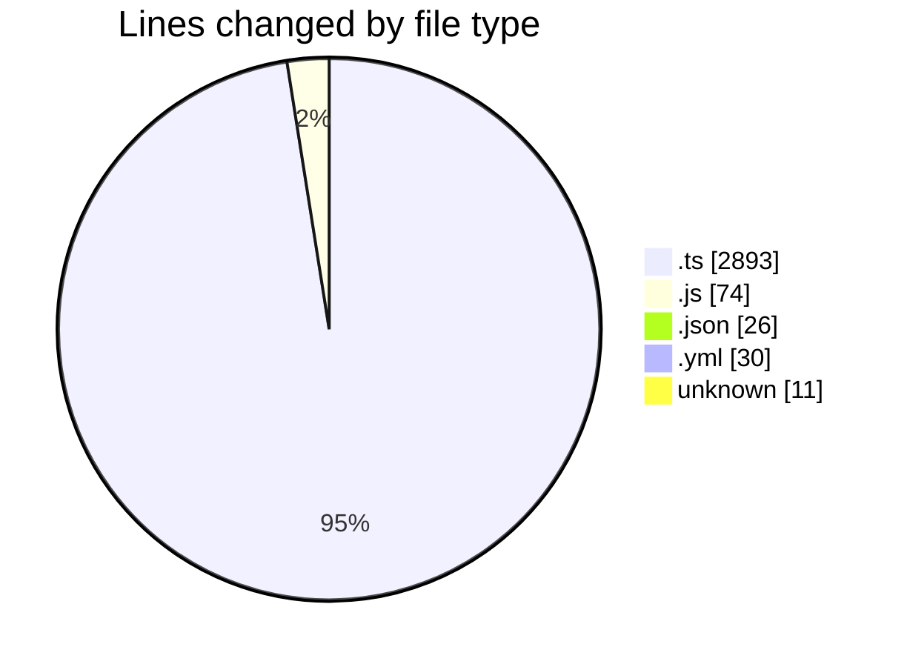
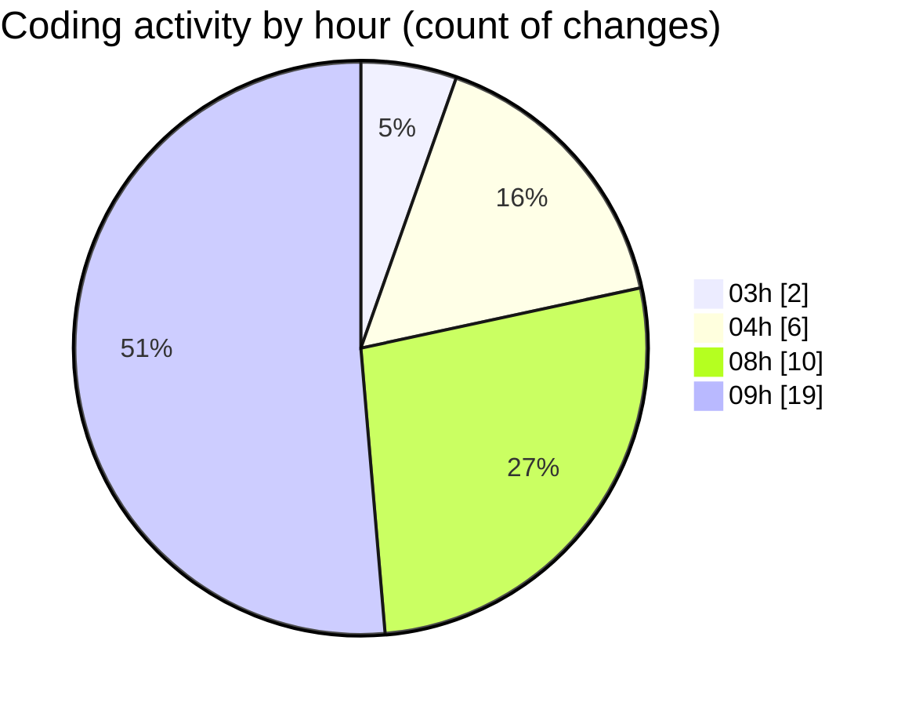

# SingularityBrainAi - Activity Summary 

## Overall Statistics

| Stat                   | Value                                                             |
| ---------------------- | ----------------------------------------------------------------- |
| **Lines Added** (➕)   | 3029                                          |
| **Lines Removed** (➖) | 5                                        |
| **Net Change** (↕)    | 3024                |
| **Active Time** (⌚)   | 55 minutes |

## Modified Files
- **gpu_supported_forces_parity_smoke.spec.ts** (+162, -0)
- **ParityHarness.ts** (+126, -5)
- **GPUBackend.ts** (+1113, -0)
- **CPUBackend.ts** (+1068, -0)
- **playwright.config.js** (+17, -0)
- **parity_contract_guard.spec.ts** (+65, -0)
- **generate_a012_baseline.ts** (+70, -0)
- **RuntimeNonRegression.ts** (+102, -0)
- **runAll.ts** (+113, -0)
- **Constants.ts** (+69, -0)
- **check_amendment.js** (+57, -0)
- **package.json** (+26, -0)
- **parity-canary.yml** (+30, -0)
- **CODEOWNERS** (+11, -0)

## Visualizations

### By File Type (Lines Changed)

### By Hour (Estimated Activity Count)

> **Last Updated:** 2/7/2026, 9:29:22 AM