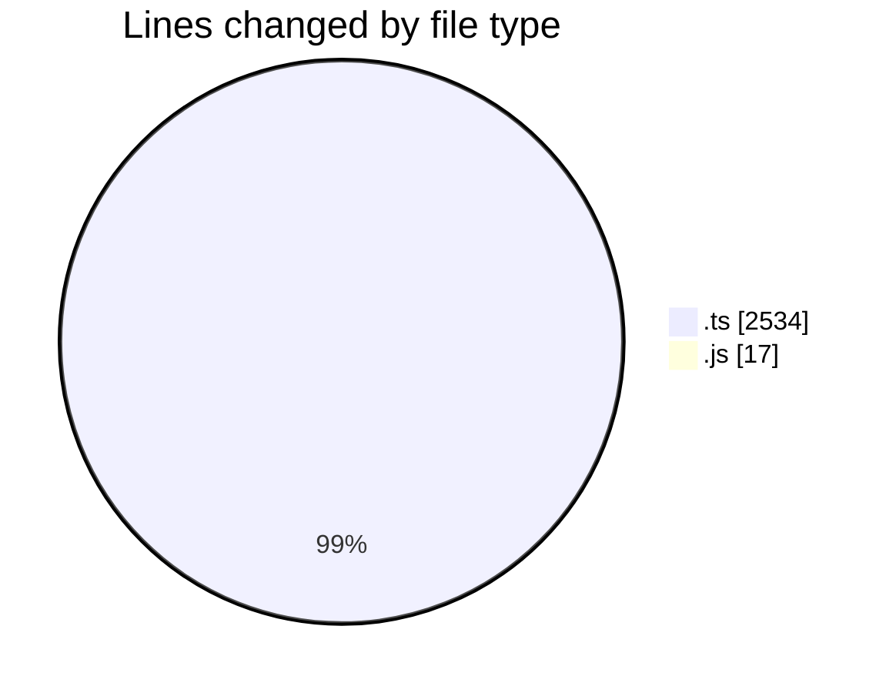
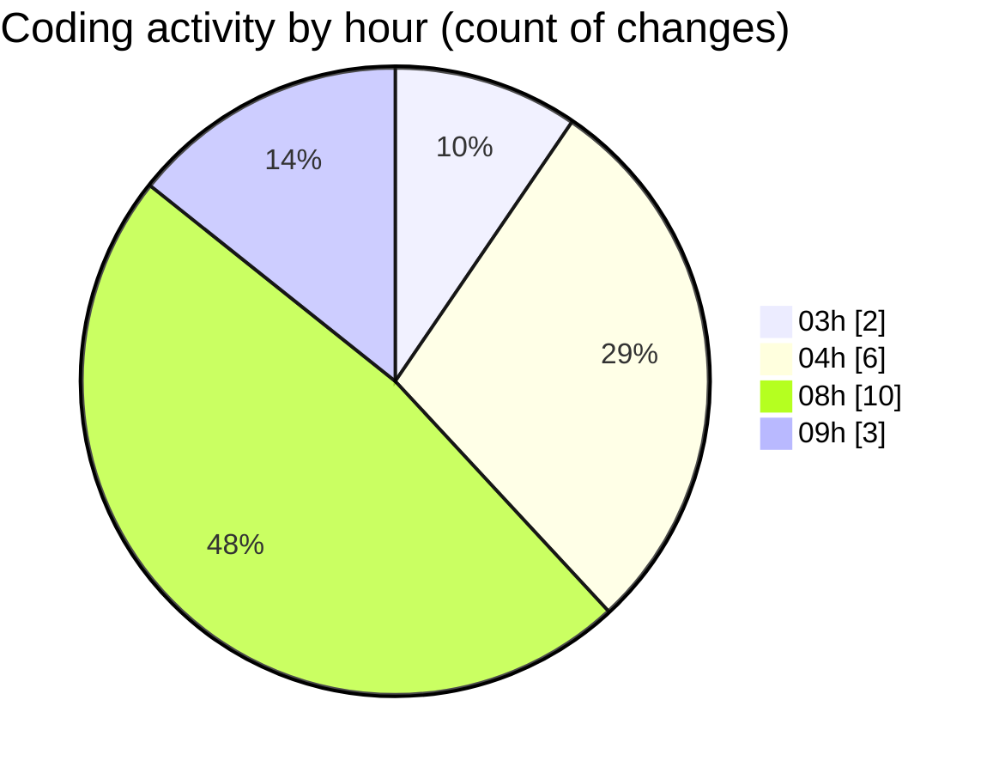

# SingularityBrainAi - Activity Summary 

## Overall Statistics

| Stat                   | Value                                                             |
| ---------------------- | ----------------------------------------------------------------- |
| **Lines Added** (➕)   | 2546                                          |
| **Lines Removed** (➖) | 5                                        |
| **Net Change** (↕)    | 2541                |
| **Active Time** (⌚)   | 37 minutes |

## Modified Files
- **gpu_supported_forces_parity_smoke.spec.ts** (+162, -0)
- **ParityHarness.ts** (+126, -5)
- **GPUBackend.ts** (+1108, -0)
- **CPUBackend.ts** (+1068, -0)
- **playwright.config.js** (+17, -0)
- **parity_contract_guard.spec.ts** (+65, -0)

## Visualizations

### By File Type (Lines Changed)

### By Hour (Estimated Activity Count)

> **Last Updated:** 2/7/2026, 9:04:22 AM