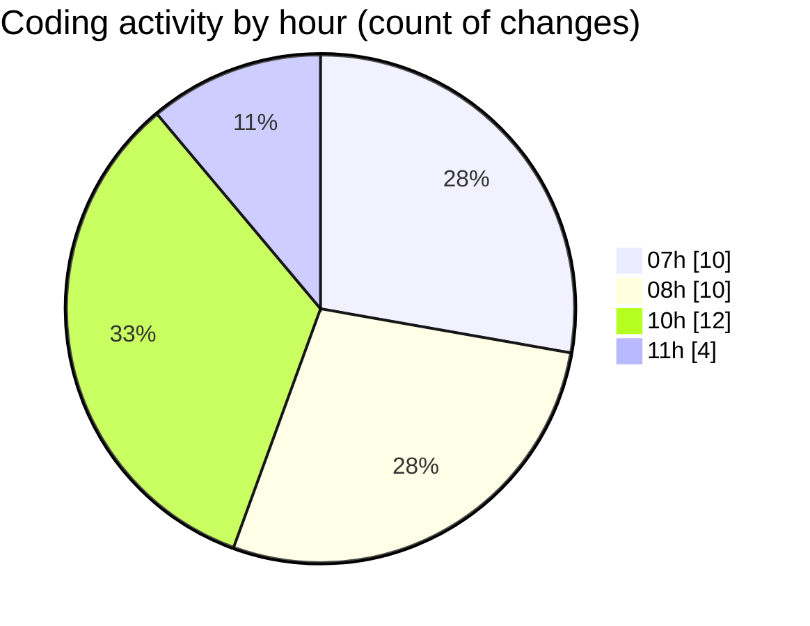

# SingularityBrainAi - Activity Summary 

## Overall Statistics

| Stat                   | Value                                                             |
| ---------------------- | ----------------------------------------------------------------- |
| **Lines Added** (➕)   | 5251                                          |
| **Lines Removed** (➖) | 664                                        |
| **Net Change** (↕)    | 4587                |
| **Active Time** (⌚)   | 52 minutes |

## Modified Files
- **main.ts** (+1585, -602)
- **check_pin_influence.spec.ts** (+23, -0)
- **index.html** (+41, -0)
- **A031_BaselineDisturbanceSafetyInvariant.ts** (+162, -0)
- **A032_OrbitEnergyEnvelopeEntropyInvariant.ts** (+196, -0)
- **runAll.ts** (+210, -46)
- **CPUBackend.ts** (+1501, -1)
- **CPUBackend.ts** (+1533, -15)

## Visualizations

### By File Type (Lines Changed)

### By Hour (Estimated Activity Count)

> **Last Updated:** 2/8/2026, 11:57:17 AM