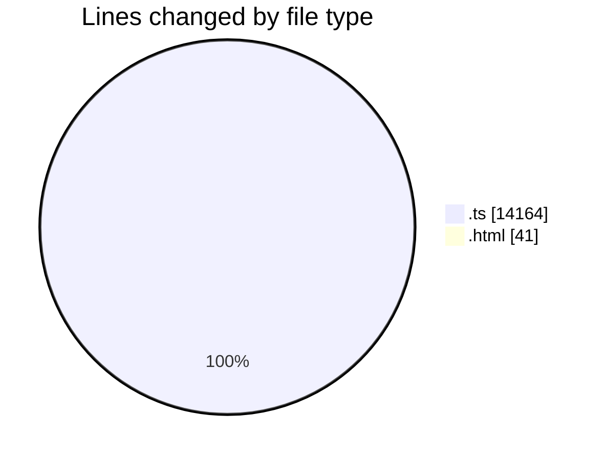
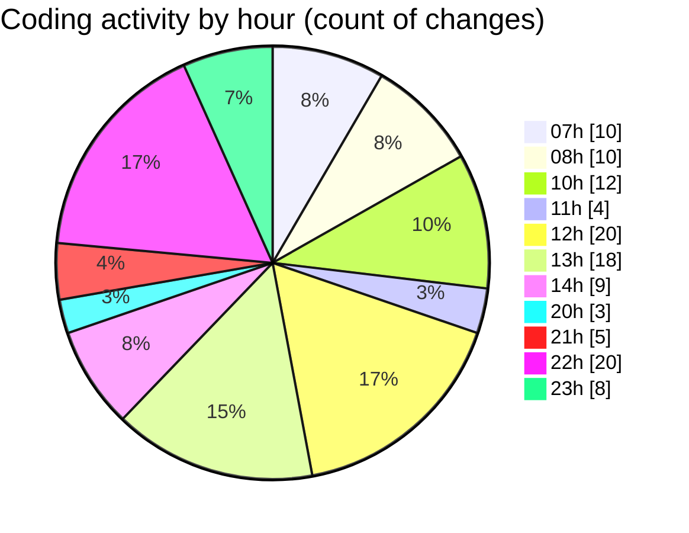

# SingularityBrainAi - Activity Summary 

## Overall Statistics

| Stat                   | Value                                                             |
| ---------------------- | ----------------------------------------------------------------- |
| **Lines Added** (➕)   | 13091                                          |
| **Lines Removed** (➖) | 1114                                        |
| **Net Change** (↕)    | 11977                |
| **Active Time** (⌚)   | 147 minutes |

## Modified Files
- **main.ts** (+1620, -631)
- **check_pin_influence.spec.ts** (+23, -0)
- **index.html** (+41, -0)
- **A031_BaselineDisturbanceSafetyInvariant.ts** (+162, -0)
- **A032_OrbitEnergyEnvelopeEntropyInvariant.ts** (+196, -0)
- **runAll.ts** (+221, -57)
- **CPUBackend.ts** (+1501, -1)
- **CPUBackend.ts** (+1621, -100)
- **A033_OrbitStabilizationZoneInvariant.ts** (+137, -0)
- **runAll.ts** (+22, -8)
- **smoke_a033.spec.ts** (+8, -0)
- **A029PinAnchorSemantics.ts** (+264, -45)
- **run_a029.ts** (+16, -0)
- **probeGL.ts** (+1003, -0)
- **EventV1.ts** (+157, -0)
- **EventStreamEngine.ts** (+202, -0)
- **probeMain.ts** (+5528, -98)
- **repro_antigravity.spec.ts** (+78, -8)
- **hierarchy_v0_smoke.spec.ts** (+182, -166)
- **hierarchy_v0_planet_moon.spec.ts** (+47, -0)
- **hierarchy_v0_visual_proof.spec.ts** (+62, -0)

## Visualizations

### By File Type (Lines Changed)

### By Hour (Estimated Activity Count)

> **Last Updated:** 2/8/2026, 11:09:20 PM