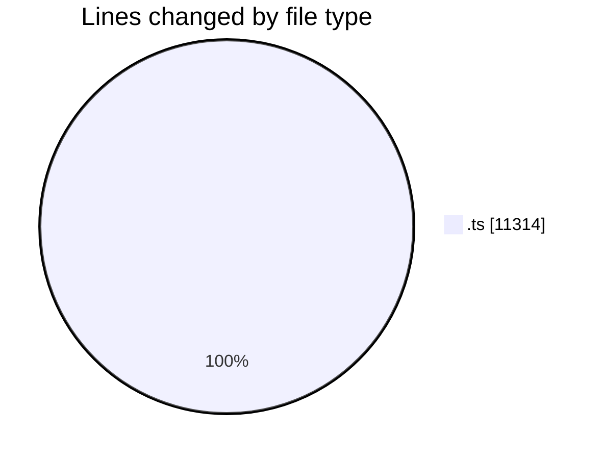
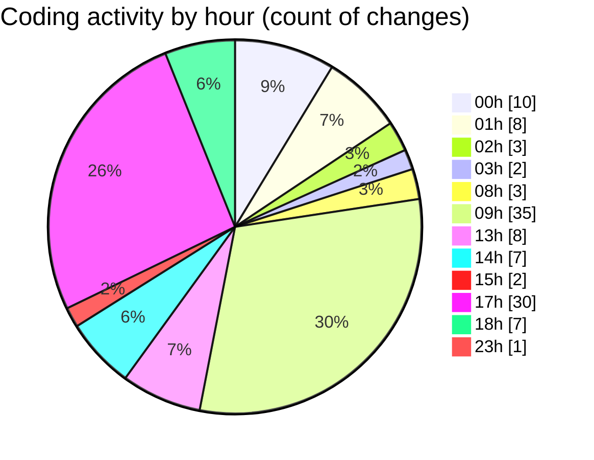

# SingularityBrainAi - Activity Summary 

## Overall Statistics

| Stat                   | Value                                                             |
| ---------------------- | ----------------------------------------------------------------- |
| **Lines Added** (➕)   | 10103                                          |
| **Lines Removed** (➖) | 1211                                        |
| **Net Change** (↕)    | 8892                |
| **Active Time** (⌚)   | 129 minutes |

## Modified Files
- **probeMain.ts** (+4637, -1120)
- **pin_orbit_visual_proof.spec.ts** (+44, -0)
- **determinism_guardrails.spec.ts** (+108, -1)
- **hierarchy_v0_visual_proof.spec.ts** (+0, -5)
- **gates_verification.spec.ts** (+95, -0)
- **EventV1.ts** (+169, -0)
- **EventStreamEngine.ts** (+201, -0)
- **Constants.ts** (+110, -0)
- **CPUBackend.ts** (+1655, -83)
- **MechanicsStabilityProof.ts** (+229, -0)
- **A032_OrbitEnergyEnvelopeEntropyInvariant.ts** (+197, -0)
- **ParityRunner.ts** (+335, -0)
- **ParityHarness.ts** (+875, -0)
- **A031_BaselineDisturbanceSafetyInvariant.ts** (+163, -0)
- **probe.ts** (+191, -2)
- **probeGL.ts** (+1094, -0)

## Visualizations

### By File Type (Lines Changed)

### By Hour (Estimated Activity Count)

> **Last Updated:** 2/9/2026, 6:35:51 PM