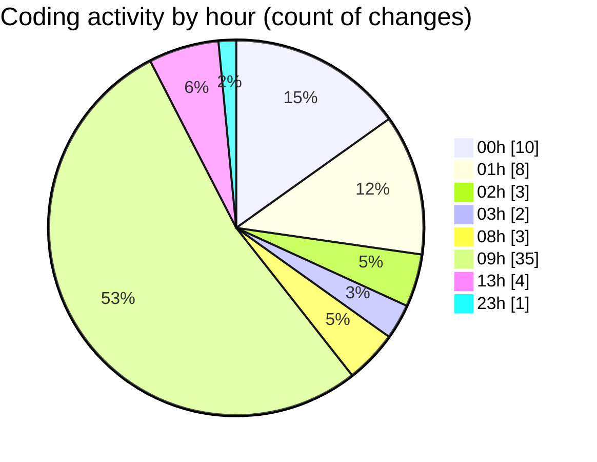

# SingularityBrainAi - Activity Summary 

## Overall Statistics

| Stat                   | Value                                                             |
| ---------------------- | ----------------------------------------------------------------- |
| **Lines Added** (➕)   | 736                                          |
| **Lines Removed** (➖) | 122                                        |
| **Net Change** (↕)    | 614                |
| **Active Time** (⌚)   | 71 minutes |

## Modified Files
- **probeMain.ts** (+489, -116)
- **pin_orbit_visual_proof.spec.ts** (+44, -0)
- **determinism_guardrails.spec.ts** (+108, -1)
- **hierarchy_v0_visual_proof.spec.ts** (+0, -5)
- **gates_verification.spec.ts** (+95, -0)

## Visualizations

### By File Type (Lines Changed)

### By Hour (Estimated Activity Count)

> **Last Updated:** 2/9/2026, 1:35:53 PM