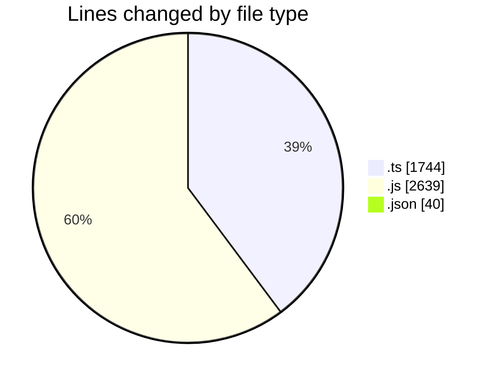
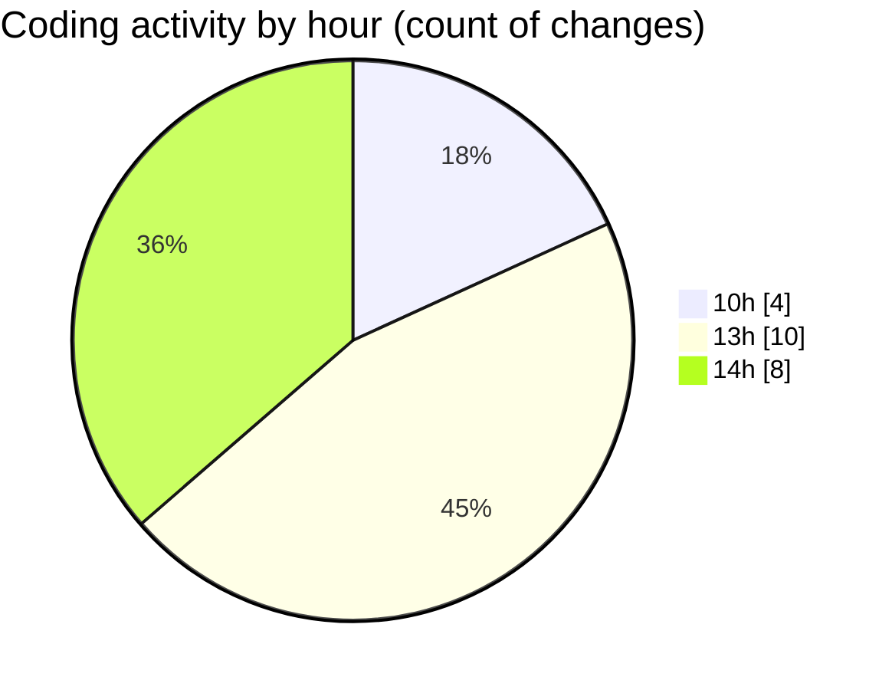

# AI NEWS SIMPLE - Activity Summary 

## Overall Statistics

| Stat                   | Value                                                             |
| ---------------------- | ----------------------------------------------------------------- |
| **Lines Added** (➕)   | 4390                                          |
| **Lines Removed** (➖) | 33                                        |
| **Net Change** (↕)    | 4357                |
| **Active Time** (⌚)   | 18 minutes |

## Modified Files
- **storage.ts** (+950, -0)
- **engine.ts** (+501, -0)
- **controller.js** (+497, -21)
- **frontend.test.js** (+473, -0)
- **ai.ts** (+282, -11)
- **ai.test.js** (+82, -0)
- **bootstrap.js** (+222, -0)
- **feed-ops.js** (+144, -0)
- **persistence.js** (+304, -0)
- **render.js** (+586, -0)
- **runtime.js** (+309, -1)
- **package.json** (+40, -0)

## Visualizations

### By File Type (Lines Changed)

### By Hour (Estimated Activity Count)

> **Last Updated:** 4/15/2026, 2:07:33 PM