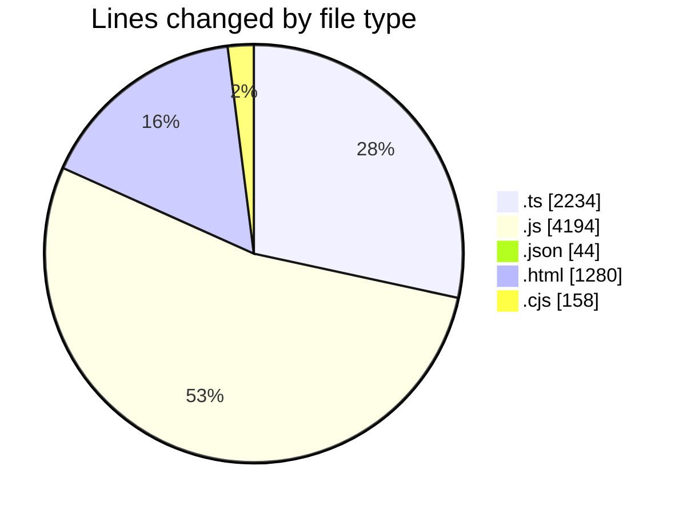
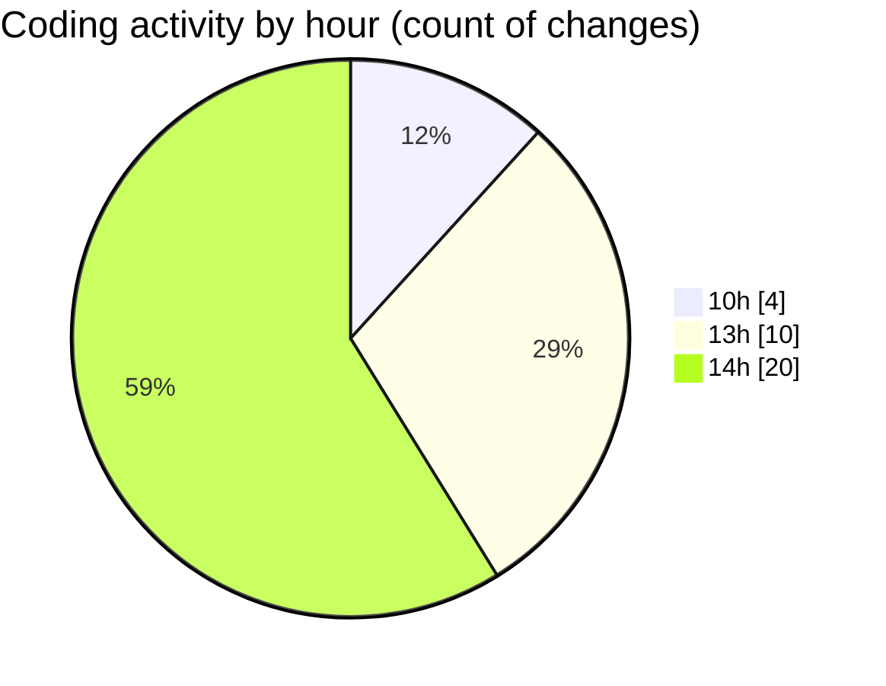

# AI NEWS SIMPLE - Activity Summary 

## Overall Statistics

| Stat                   | Value                                                             |
| ---------------------- | ----------------------------------------------------------------- |
| **Lines Added** (➕)   | 7399                                          |
| **Lines Removed** (➖) | 511                                        |
| **Net Change** (↕)    | 6888                |
| **Active Time** (⌚)   | 37 minutes |

## Modified Files
- **storage.ts** (+950, -0)
- **engine.ts** (+502, -1)
- **controller.js** (+497, -21)
- **frontend.test.js** (+473, -0)
- **ai.ts** (+282, -11)
- **ai.test.js** (+82, -0)
- **bootstrap.js** (+222, -0)
- **feed-ops.js** (+144, -0)
- **persistence.js** (+304, -0)
- **render.js** (+586, -0)
- **runtime.js** (+309, -1)
- **package.json** (+40, -0)
- **index.html** (+1280, -0)
- **serve-local.js** (+664, -477)
- **settings.json** (+4, -0)
- **scoring.ts** (+465, -0)
- **eslint.config.cjs** (+158, -0)
- **shared-core.d.ts** (+23, -0)
- **app-support.js** (+414, -0)

## Visualizations

### By File Type (Lines Changed)

### By Hour (Estimated Activity Count)

> **Last Updated:** 4/15/2026, 2:17:33 PM