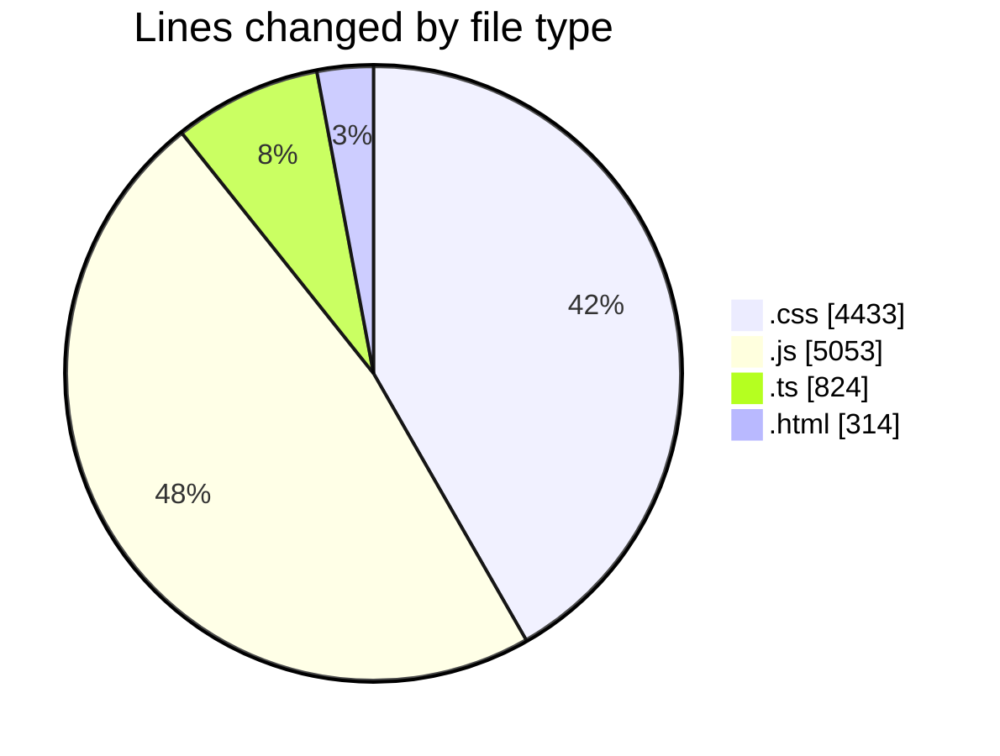
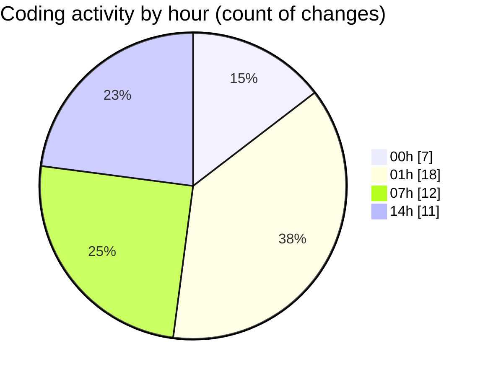

# DarkWire - Activity Summary 

## Overall Statistics

| Stat                   | Value                                                             |
| ---------------------- | ----------------------------------------------------------------- |
| **Lines Added** (➕)   | 10342                                          |
| **Lines Removed** (➖) | 282                                        |
| **Net Change** (↕)    | 10060                |
| **Active Time** (⌚)   | 53 minutes |

## Modified Files
- **base.css** (+640, -0)
- **bootstrap.js** (+0, -25)
- **feed.css** (+1581, -18)
- **local-context.ts** (+122, -0)
- **handlers.ts** (+702, -0)
- **local-buzz.js** (+342, -238)
- **render-feed.js** (+609, -1)
- **handlers.test.js** (+954, -0)
- **frontend.test.js** (+1815, -0)
- **prerender-feed.js** (+482, -0)
- **verify-production.js** (+587, -0)
- **index.html** (+314, -0)
- **topbar.css** (+419, -0)
- **animations.css** (+309, -0)
- **responsive.css** (+441, -0)
- **sections.css** (+440, -0)
- **cards.css** (+585, -0)

## Visualizations

### By File Type (Lines Changed)

### By Hour (Estimated Activity Count)

> **Last Updated:** 4/24/2026, 2:12:15 PM