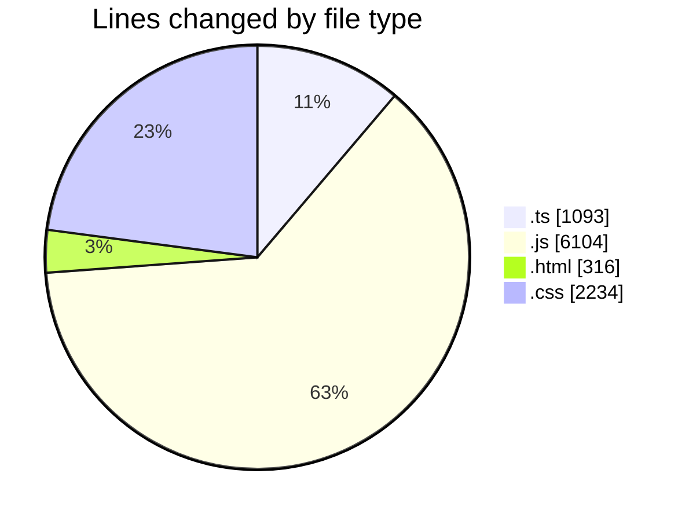
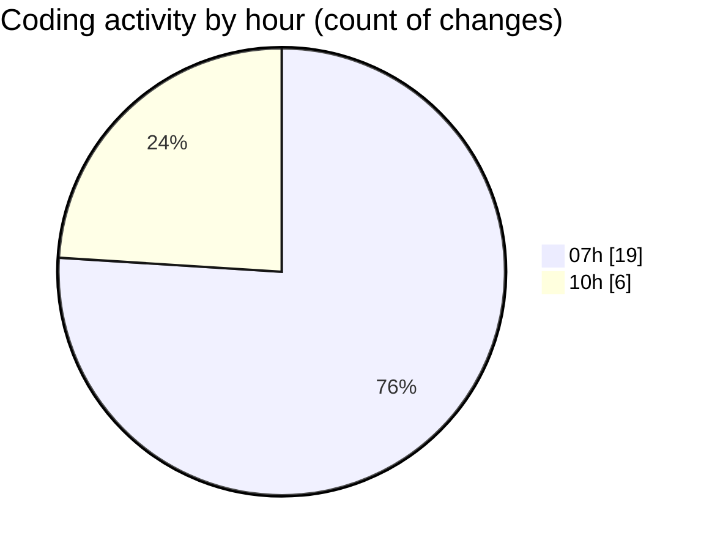

# DarkWire - Activity Summary 

## Overall Statistics

| Stat                   | Value                                                             |
| ---------------------- | ----------------------------------------------------------------- |
| **Lines Added** (➕)   | 9736                                          |
| **Lines Removed** (➖) | 11                                        |
| **Net Change** (↕)    | 9725                |
| **Active Time** (⌚)   | 26 minutes |

## Modified Files
- **config.ts** (+47, -0)
- **frontpage-quality.ts** (+88, -0)
- **render-shared.js** (+161, -0)
- **render-feed.js** (+618, -4)
- **prerender-feed.js** (+482, -4)
- **bootstrap.js** (+328, -0)
- **index.html** (+316, -0)
- **verify-production.test.js** (+766, -0)
- **cards.css** (+1247, -0)
- **render.js** (+553, -2)
- **prerender-index.js** (+233, -0)
- **topbar.css** (+528, -0)
- **responsive.css** (+459, -0)
- **frontend.test.js** (+1918, -0)
- **prerender-index.test.js** (+443, -0)
- **ai.ts** (+688, -1)
- **shared-feeds.js** (+227, -0)
- **scoring-config.ts** (+269, -0)
- **local-buzz.js** (+365, -0)

## Visualizations

### By File Type (Lines Changed)

### By Hour (Estimated Activity Count)

> **Last Updated:** 4/25/2026, 10:40:35 AM